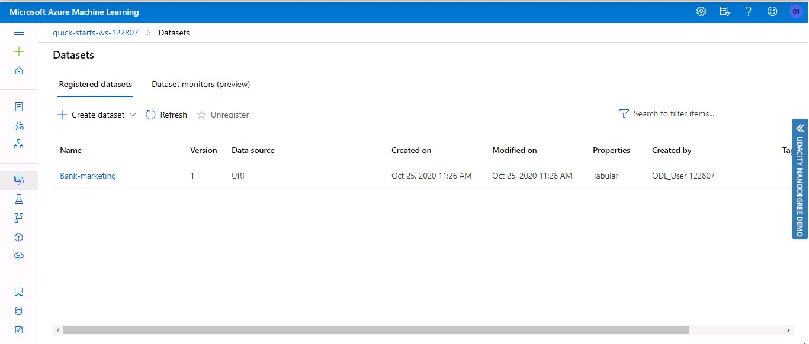
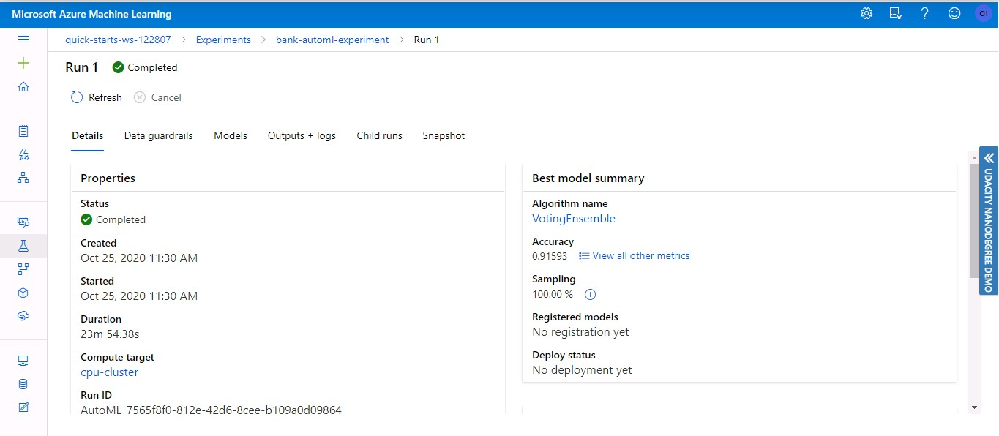
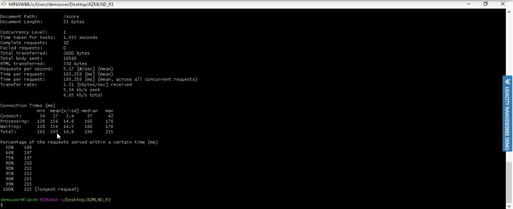

# Operationalizing Machine Learning

In this project, we will use Microsoft Azure to demonstrate Machine Learning operations. Dataset used is the [Bank Marketing dataset](https://automlsamplenotebookdata.blob.core.windows.net/automl-sample-notebook-data/bankmarketing_train.csv).

- First, using the Azure ML Studio, we will configure a cloud-based machine learning production model, deploy it, and consume the model endpoint via an HTTP API.
- After that, using the Python SDK, we will create, publish, and consume a pipeline. Also, we will schedule a pipeline run.

## Architecture Diagram

## Screen Recording
[Video link](https://youtu.be/pRCSAkf2lUc)

## Future Improvements
- Add best model deployment in ONNX format step to the pipeline.
- Use the `ParallelRunStep` class for async batch scoring.

## Key Steps

1. The "Bank-marketing" dataset is registered using an URI. The registered dataset will be used to train the model. The image below shows Registered Datasets tab under the Datasets section in ML Studio, having "Bankmarketing" dataset available, along with other details like data source, Version, Properties(Tabular Dataset).

2. Using the Registered Dataset, an AutoML run experiment was created and is completed in the experiment section. The step is perfomed to train the model. The image below shows experiment is completed. It also shows the Compute Target and the Run Type.

3. After the AutoML run is completed, we get the best model. The image below shows Summary of best model after the run the completed. The summary shows the AlgorithmName and the Accuracy score. The best model is then deployed with endpoint name "bank-automl-model". During deployment, authentication is enabled for the endpoint.

4. The Applications Insight or Logging is enabled by running the provided `logs.py` script. The image below shows the output of `logs.py` file.

5. The image below shows Endpoints section in Azure ML Studio, showing that “Application Insights enabled” says “true”. This step is performed to confirm the Application Insight is enabled for the endpoint.

6. Using the Swagger package and the enpoint's `swagger.json` file, we get the model's documentation. The image below shows Swagger running on localhost, showing the HTTP API methods and responses for the model.

7. The endpoint is consumed using the `endpoint.py` script. The script has 2 sample input data, it sends a post request to the endpoint, response is the output from the model. The image below shows `endpoint.py` execution against the API, producing JSON output from the model.

8. The endpoint load testing is performed using the Apache benchmark. The image below shows Apache Benchmark (ab) execution against the HTTP API using authentication keys to retrieve performance results.

9. The pipeline section of Azure ML studio, showing the pipeline runs are completed. The bottom run is when the pipeline is created using AutoML steps, and the top run is after the pipeline is published, the run is executed using the REST endpoint.

10. From pipeline run graph, it is confirmed that the dataset is used as input to the automl module. The image below shows the Bankmarketing dataset with the AutoML module.

11. The “Published Pipeline overview”, having a REST endpoint and a status of ACTIVE is confirmed.

12. The "Pipeline" section of Azure ML studio, showing the pipeline endpoint as ACTIVE is confirmed.

13. Using the Python SDK, the pipeline run details are examined. The image below shows Jupyter Notebook having the RunDetails with the step runs.

14. The image below shows the Jupyter Notebook with the best model trained and it's parameters.

15. Using the ScheduleRun and Schedule class, a pipeline run is scheduled. The image below shows the Jupyter Notebook with the scheduled pipline run id. 

