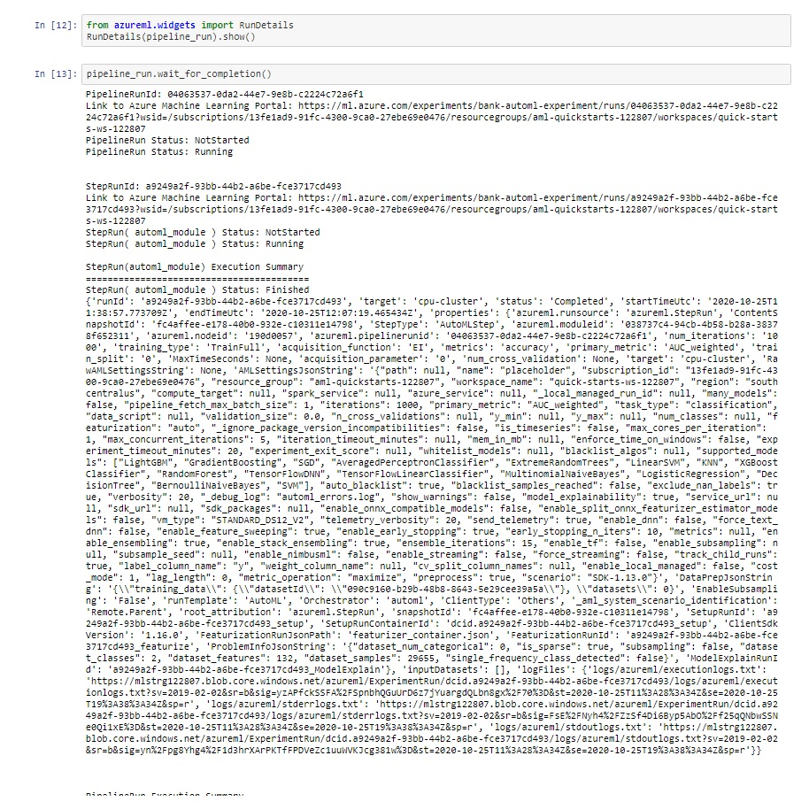
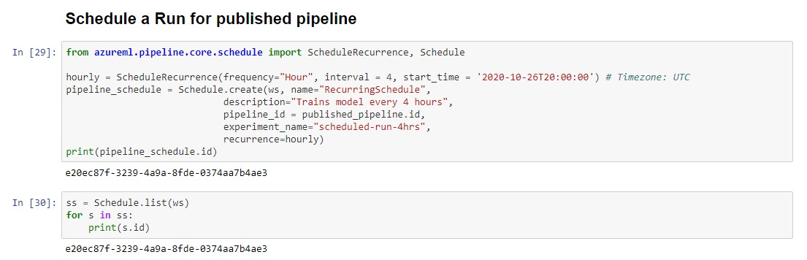

# Operationalizing Machine Learning

In this project, we will use Microsoft Azure to demonstrate Machine Learning operations. Dataset used is the [Bank Marketing dataset](https://automlsamplenotebookdata.blob.core.windows.net/automl-sample-notebook-data/bankmarketing_train.csv).

- First, using the Azure ML Studio, we will configure a cloud-based machine learning production model, deploy it, and consume the model endpoint via an HTTP API.
- After that, using the Python SDK, we will create, publish, and consume a pipeline. Also, we will schedule a pipeline run.

## Architectural Diagram

## Screen Recording
[Video link](https://youtu.be/h0QHCFeEj9I)

## Future Improvements
- Add best model deployment in ONNX format step to the pipeline.
- Use the `ParallelRunStep` class for async batch scoring.

## Key Steps

1. Registered Datasets in ML Studio shows "Bankmarketing" dataset available.

2. AutoML run experiment is shown as completed.

3. Summary of best model after the run the completed

4. Endpoints section in Azure ML Studio, showing that “Application Insights enabled” says “true”.

5. Logging is enabled by running the provided `logs.py` script

6. Swagger runs on localhost showing the HTTP API methods and responses for the model

7. `endpoint.py` script runs against the API producing JSON output from the model.

8. Apache Benchmark (ab) runs against the HTTP API using authentication keys to retrieve performance results.

9. The pipeline section of Azure ML studio, showing the pipeline runs.

10. The pipeline section of Azure ML studio, showing the pipeline endpoint as Active.

11. Jupyter Notebook showing the RunDetails with the step runs

12. Jupyter Notebook showing the best model trained with it's parameters

13. Jupyter Notebook showing the scheduled pipline run
 
